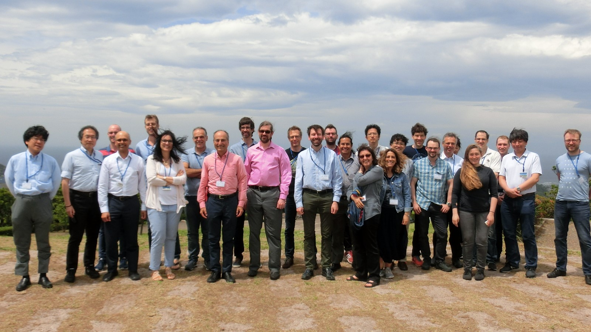
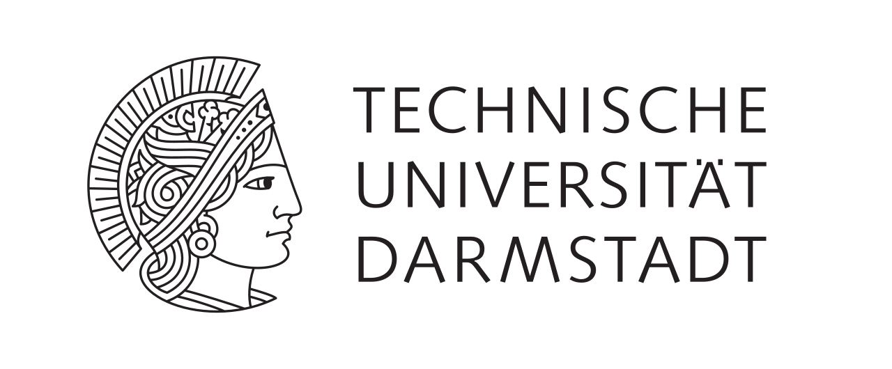

# PL4DS Meetings and Event Series

PL4DS is a a series of meetings and events around research on Programming Languages for Distributed Systems.

Programming languages for distributed systems have been flourishing in the past, providing ideas for the development of complex systems that have been deeply influential. However, over the last few years, researchers focusing on this area are scattered across different communities with limited interaction.

<a href="https://twitter.com/intent/tweet?button_hashtag=PL4DS&ref_src=twsrc%5Etfw" class="twitter-hashtag-button" data-size="large" data-show-count="false">Tweet #PL4DS</a>

### What this is about

Developing distributed systems is a well-known, decades-old problem in Computer Science. Despite significant research effort has been dedicated to this area, developing distributed systems remains challenging. 

Programming languages are a fundamental tool to face the complexity of such a scenario. In comparison, however, these have seen modest improvements. Arguably, many ideas for supporting distribution adopted in production languages date back to the early ’90s with CORBA/RMI, and even earlier with the Actor model and concurrent objects. 

In recent years, there have been, notable advances in research on programming languages for distributed systems (e.g, CRDTs, lineage in Spark, functional programming in MapReduce, verification of distributed algorithms, language integrated queries). However, the researchers that have been carrying out these efforts are scattered across different communities that include verification and formal methods in general, programming language design, database theory, distributed systems, systems programming, data-centric programming, and web application development.

# PL4DS Events

---

### PLDS Workshop (March 2020)

Organized by Paris Carbone and Lars Kroll.

- [Workshop Page](https://plds.github.io/programme.html)

 
 
 
 

---

### PL4DS Dagstuhl Seminar (October 2019)

Organized by Carla Ferreira, Philipp Haller, Guido Salvaneschi.

- [Meeting Page](https://www.dagstuhl.de/en/program/calendar/semhp/?semnr=19442)

- [Presentations](https://github.com/pl4ds/Dagstuhl-2019/blob/master/pages/Dagstuhl.md)

 
 
 
 

---

### PL4DS Shonan Seminar (May 2019)

Organized by Philipp Haller, Guido Salvaneschi, Takuo Watanabe, Gul Agha

- [Meeting Page](https://shonan.nii.ac.jp/seminars/149/)

- [Presentations](https://github.com/pl4ds/Shonan-2019/blob/master/Pages/shonan.md)

 
 
 
 

---

### PL4DS Meeting in Darmstadt (February 2018)

Organized by Guido Salvaneschi, Mira Mezini, Philipp Haller.

- [Presentations](https://github.com/pl4ds/Darmstadt-2018/blob/master/pages/darmstadt.md)

 
 
 
 

